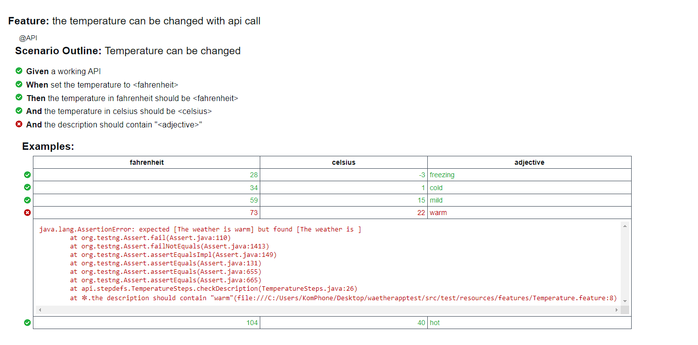
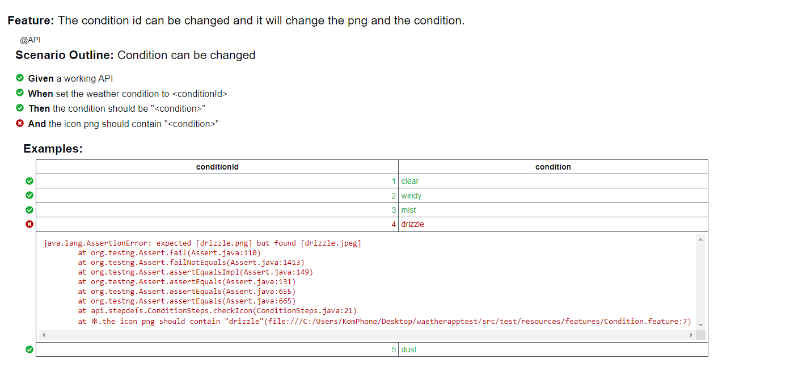
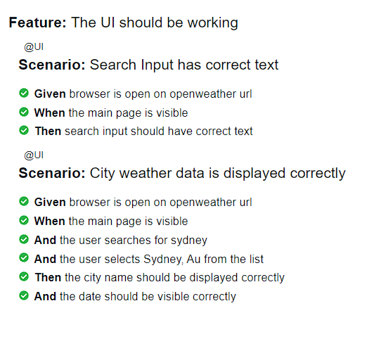

# Weather 'application' test framework

## Used technologies:
- java
- maven
- testNG
- restAssured
- cucumber
- selenium

Report of the test suite run is in path: `target/report/Report.html`

Commands:

Run the test suite: 
`mvn test`

Run the UI test suite: 
`mvn clean test -Dcucumber.filter.tags="@UI"`

Run the API test suite:
`mvn clean test -Dcucumber.filter.tags="@API"`

Report of the last run:

